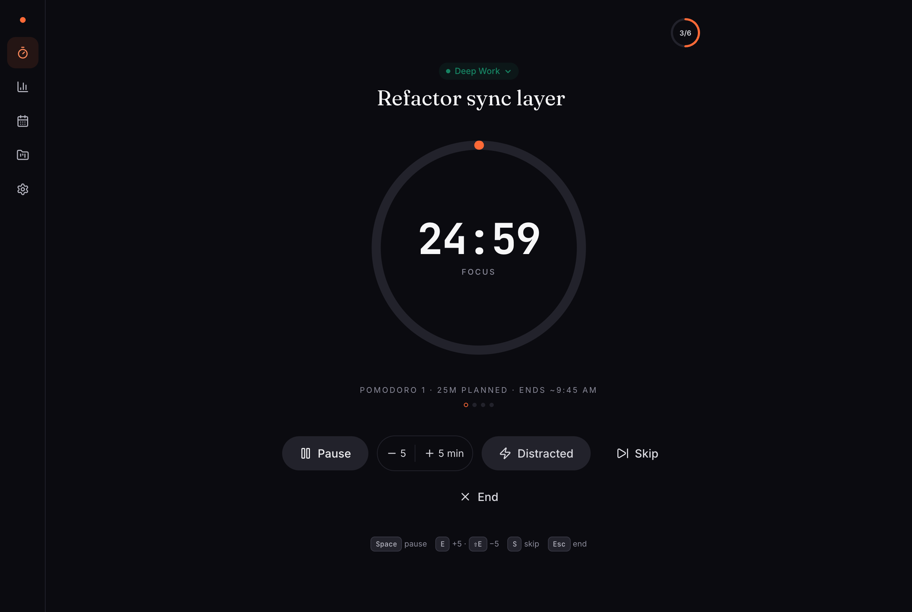
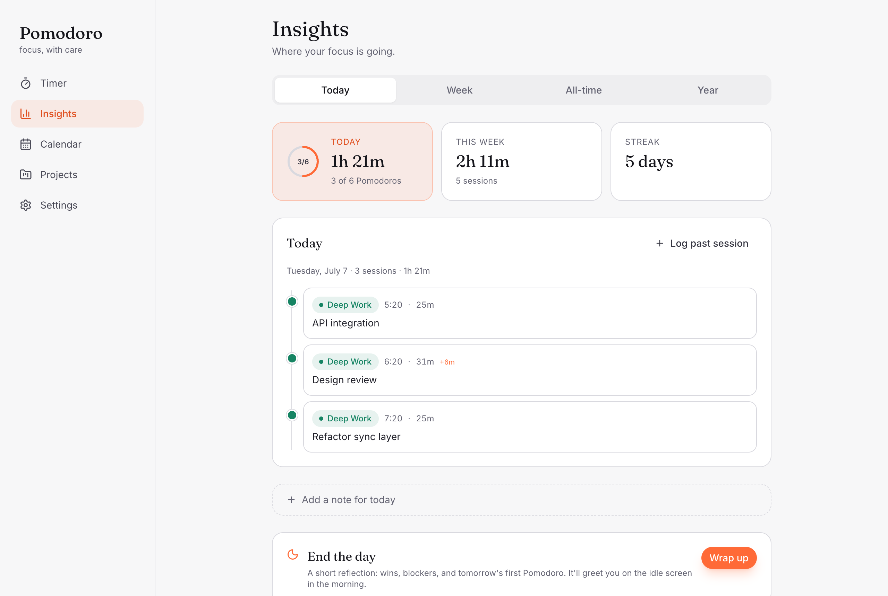

# Pomodoro

A local-first Pomodoro timer for people who want a calmer relationship with their work: a breathing ritual before each session, flexible timing that respects flow, honest stats, and a macOS menu-bar app that stays out of the way.

Everything lives on your device (IndexedDB). Cloud sync, calendar export, and the AI weekly review are all optional, bring-your-own-key, and off by default.





## Install (macOS)

Grab the latest `.dmg` from [Releases](https://github.com/jasonalmine/pomodoro/releases), open it, and drag **Pomodoro** to Applications.

The app is not signed with an Apple Developer certificate, so on first launch macOS will refuse to open it. Two ways past that, pick one:

- Right-click **Pomodoro.app** in Applications → **Open** → **Open** in the dialog, or
- run once in Terminal: `xattr -cr /Applications/Pomodoro.app`

It lives in your menu bar: click the icon for a compact timer popover, or expand to the full app. The tray title shows the live countdown (and `+MM:SS` when you run over).

### Or use it in the browser

It's a static web app — run it locally (below) or deploy it to any static host. HTTPS is required outside localhost for notifications, wake lock, and `crypto.randomUUID`.

## Features

- **Flexible timer** — work / short break / long break durations per session, long-break cadence, auto-start toggles. Overtime mode (default) lets a session run past the boundary and shows the overshoot on a second ring; strict mode auto-advances.
- **Flow mode** — an open-ended count-up session for when the work doesn't fit a box. Wrap up whenever; the break scales to how long you flowed.
- **Pre-session ritual** — a configurable breathing warm-up (Box, 4-7-8, Coherent, Energize) with soft cue tones.
- **Projects & tasks** — pick a project, name the work, link tasks with estimates, drag to reorder.
- **Reflection** — a one-line "what did you finish?" after each session, with tags. Skippable, never nags.
- **Insights** — daily goal ring, streaks, 8-week trend, per-project breakdowns, hour-of-day histogram, GitHub-style year heatmap.
- **Calendar** — month heatmap of focus minutes, week/day schedules, click any session to edit, log past sessions you forgot to track.
- **Audio cues** — procedural WebAudio (no sound assets): boundary chimes, subtle repeating overtime reminders, distinct pitches for "focus ran over" vs "break is over", ambient focus sounds (rain, brown noise, lo-fi, ticking).
- **Day shutdown** — an end-of-day ritual (wins, blockers, tomorrow's first Pomodoro) that greets you the next morning.
- **Keyboard shortcuts** — Space pause/resume, S skip, E/⇧E ±5 min, Esc end.
- **Optional cloud sync** — Supabase-backed, last-write-wins, works across devices. The app is fully functional without it.
- **Optional Google Calendar export** — completed focus blocks land on your calendar via [Maton](https://maton.ai) (bring your own key; the app never sees your Google login).
- **Optional AI weekly review** — a short coach-style summary of your week (Anthropic, OpenAI, or Gemini key — stored only on-device).

## Privacy posture

- The working store is IndexedDB in your browser/webview. No backend of its own, no analytics, no tracking.
- API keys (Maton, AI provider) live only on the device, are never synced, and are stripped from JSON exports.
- Cloud sync is opt-in and scoped to your own Supabase project.

## Develop

```bash
npm install
npm run dev        # http://localhost:5173
npm run build      # typecheck + production build
npm run lint
```

### macOS app (Tauri v2)

```bash
npm run tauri:dev    # run the menu-bar app against the dev server
npm run tauri:build  # bundle Pomodoro.app + .dmg (src-tauri/target/release/bundle)
```

Requires the Rust toolchain. The desktop app is the same web bundle in a Tauri shell — a compact menu-bar popover plus the full window, with a live tray countdown.

### Optional cloud sync

Copy `.env.example` to `.env` and fill in your Supabase URL + anon key, then apply the migrations in `supabase/migrations/` (`npm run db:push` with a linked Supabase CLI). See [docs/SUPABASE_SETUP.md](docs/SUPABASE_SETUP.md). Without `.env`, all sync paths no-op and the app stays local.

## Deploy the web app

Any static host works. `vercel.json` ships SPA rewrites and cache headers for Vercel; `deploy.sh` rsyncs `dist/` to a VPS behind Caddy (see the script header for usage).

## Stack

Vite · React 19 · TypeScript · Tailwind v3 · Zustand (timer state machine) · Dexie/IndexedDB (persistence) · Supabase (optional sync) · Tauri v2 (macOS shell) · WebAudio (all sound, procedural)

## Project layout

```
src/
  audio/        WebAudio engine (chimes, ambient, breath cues)
  components/   Reusable UI (RingTimer, ProjectChipPicker, panels, viz)
  db/           Dexie schema, defaults, seed
  hooks/        settings, sync, ticks, wake lock, audio effects, shortcuts
  lib/          stats, sync, AI review, Google Calendar client, export/import
  store/        Zustand timer phase machine
  views/        Timer, Insights, Calendar, Projects, Settings
src-tauri/      Tauri v2 shell (menu-bar window, tray countdown)
supabase/       SQL migrations for optional sync
```

## License

[MIT](LICENSE)
